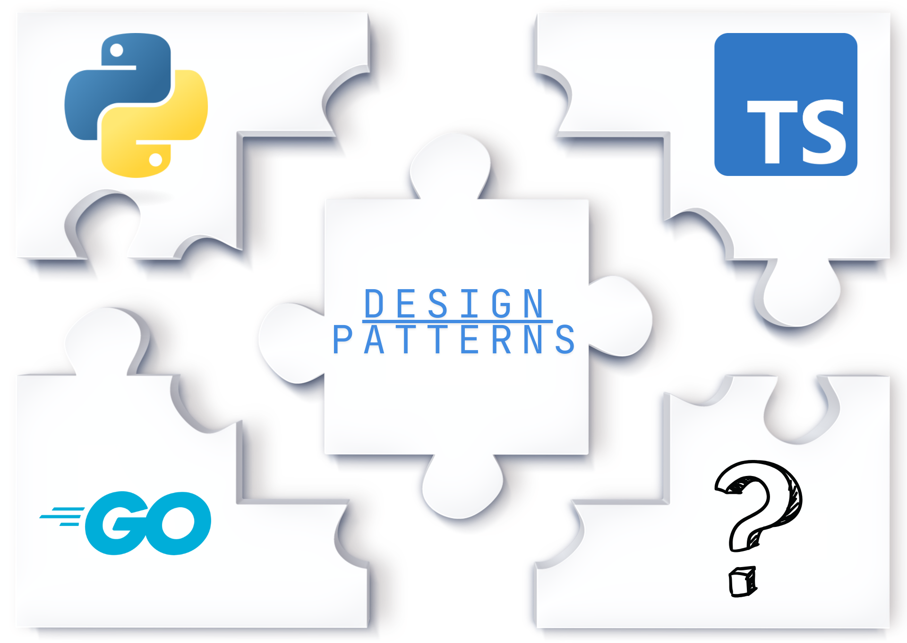

# 🚀 Design Patterns Across Languages 🐍  

Unlock the power of software design patterns with practical, real-world examples implemented in Python, TypeScript, and Go! ✨



This repository isn't just another collection of abstract design pattern definitions. It's a hands-on learning playground designed to show you _how_ and _why_ to use design patterns in everyday software development scenarios.

## 🤔 Why This Repository?

- **Practical First:** Forget `Foo` and `Bar`! We focus on relatable, real-world problems like building middleware, processing payments, analyzing code, or managing configurations.
- **Multi-Lingual Mastery:** See how the same fundamental pattern concepts translate across different language paradigms – Python's dynamism, TypeScript's static typing, and Go's concurrency focus. 🌐
- **Educational Focus:** Built for developers who want to level up their architectural thinking and write cleaner, more maintainable, and scalable code. 🎓
- **Ready to Run & Test:** Each example comes with clear setup, execution, and testing instructions. Clone, run, learn! ✅

## 🧩 Patterns Covered

We've implemented a wide range of patterns, categorized for clarity:

### 🏛 Creational Patterns

_Patterns focused on object creation mechanisms, trying to create objects in a manner suitable to the situation._

1.  **Singleton:** Configuration Manager ⚙️
2.  **Factory Method:** Document Processor Factory (PDF, DOCX, etc.) 📄
3.  **Abstract Factory:** LLM Provider Factory (e.g., OpenAI, Anthropic) 🏭
4.  **Builder:** Dynamic Workflow Construction 🏗️
5.  **Prototype:** Molecular Simulation Cloning 🧬

### 🧱 Structural Patterns

_Patterns explaining how to assemble objects and classes into larger structures while keeping these structures flexible and efficient._

1.  **Adapter:** Logging Library Adapter 🔌
2.  **Bridge:** Cross-Platform Notification System 🌉
3.  **Composite:** File System Representation 📁
4.  **Decorator:** Request Pipeline Enhancement ✨
5.  **Facade:** Simplified Video Streaming API 🎬
6.  **Flyweight:** Efficient Map Rendering 🗺️
7.  **Proxy:** Lazy Image Loading 🖼️

### 🎭 Behavioral Patterns

_Patterns concerned with algorithms and the assignment of responsibilities between objects._

1.  **Chain of Responsibility:** HTTP Request Middleware Pipeline 🔗
2.  **Command:** Task Scheduler ⏰
3.  **Interpreter:** Query Language Parser 🔍
4.  **Iterator:** Data Stream Processor 🌊
5.  **Mediator:** Chat Room 💬
6.  **Memento:** Document Editor (Undo/Redo) 💾
7.  **Observer:** Event Monitoring System 👀
8.  **State:** Order Processing Workflow 🔄
9.  **Strategy:** Payment Processing Options 💳
10. **Template Method:** Data Export Framework 📊
11. **Visitor:** Code Analyzer Tool 🔬

## 📁 Repository Structure

Each pattern example follows a consistent structure:

```
pattern_category/
└── pattern_name/
    └── example_name/         # e.g., http_request_middleware
        ├── README.md         # Specific example documentation
        ├── go/               # Go implementation
        │   ├── go.mod
        │   ├── main.go       # Runnable example
        │   └── ...           # Pattern implementation & tests
        ├── python/           # Python implementation
        │   ├── __init__.py
        │   ├── main.py       # Runnable example
        │   └── ...           # Pattern implementation & tests
        └── typescript/       # TypeScript implementation
            ├── package.json
            ├── tsconfig.json
            ├── jest.config.js
            ├── main.ts       # Runnable example
            └── ...           # Pattern implementation & tests
```

## 🚀 Getting Started

1.  **Clone the repository:**
    ```bash
    git clone https://github.com/Eng-Elias/design-patterns-across-languages.git
    cd design-patterns-across-languages
    ```
2.  **Navigate to an example:**
    ```bash
    cd behavioral/chain_of_responsibility/http_request_middleware
    ```
3.  **Follow the `README.md`:** Each example directory has its own `README.md` with specific setup, run, and test instructions for Python, TypeScript, and Go.

## 🤝 Contribution Guide

Contributions are highly welcome! Whether it's adding a new pattern/example, improving an existing example, or fixing a bug, your help makes this resource better.

To ensure consistency, please follow these guidelines when contributing a new pattern example:

1.  **Choose a Practical Example:** Think of a real-world scenario where the pattern shines.
2.  **Implement in All Three Languages:** Provide implementations in Python, TypeScript, and Go.
3.  **Follow the Directory Structure:** Create directories as shown in the "Repository Structure" section.
4.  **Include Tests:** Write unit tests for each language implementation.
5.  **Add a `README.md`:** Use the `CODE_EXAMPLE_README_TEMPLATE.md` as a base. Your example's `README.md` _must_ include:
    - **Problem:** The specific problem your example solves.
    - **Solution/Implementation:** How the pattern is applied in your example for each language.
    - **Setup:** Clear, language-specific setup steps (dependencies, etc.).
    - **How to Run:** Language-specific commands to execute the example.
    - **How to Test:** Language-specific commands to run the tests.
6.  **Create a Pull Request:** Explain your changes clearly in the PR description.

## 📖 Learn More

Read my detailed article on my Medium blog:

**https://medium.com/@eng_elias/different-approaches-to-implement-design-patterns-across-different-programming-languages-from-ffc298fead7d** 📝

## Support

Happy Coding! 🎉 If you find this repository useful, please consider giving it a star ⭐!

Like what you see? Support future open-source content by buying me a book:

[https://www.buymeacoffee.com/eng_elias](https://www.buymeacoffee.com/eng_elias)

[](https://www.buymeacoffee.com/eng_elias)

## License

This application is open-source and is released under the Creative Commons Attribution-NonCommercial-ShareAlike 4.0 International License. See the [LICENSE](LICENSE) file for details.

Shield: [![CC BY-NC-SA 4.0][cc-by-nc-sa-shield]][cc-by-nc-sa]

This work is licensed under a
[Creative Commons Attribution-NonCommercial-ShareAlike 4.0 International License][cc-by-nc-sa].

[![CC BY-NC-SA 4.0][cc-by-nc-sa-image]][cc-by-nc-sa]

[cc-by-nc-sa]: http://creativecommons.org/licenses/by-nc-sa/4.0/
[cc-by-nc-sa-image]: https://licensebuttons.net/l/by-nc-sa/4.0/88x31.png
[cc-by-nc-sa-shield]: https://img.shields.io/badge/License-CC%20BY--NC--SA%204.0-lightgrey.svg
